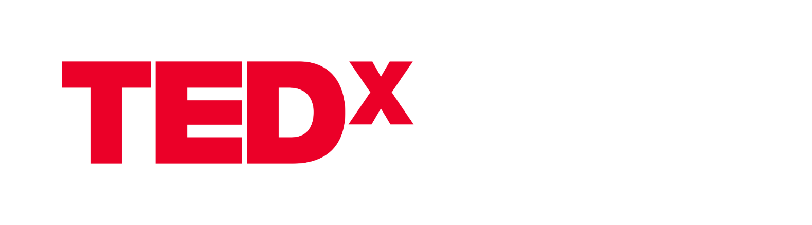

# TEDxSMIT Website (Official)



This is the repository of the official website for TEDxSMIT, organized by the Sikkim Manipal Institute of Technology.

## About TEDxSMIT

TEDxSMIT is an independently organized TED event that brings together innovative thinkers, passionate speakers, and a curious audience. It is a platform where ideas worth spreading are shared, discussed, and celebrated.

## Features

- Engaging speaker profiles
- Event schedule and details
- Registration form
- Interactive agenda
- Contact information

## Technologies Used

- Vite
- React
- HTML/CSS
- JavaScript

## Getting Started

1. Clone the repository:

```bash
git clone https://github.com/yourusername/TEDxSMIT-Website.git
```
2. Install Dependencies
Navigate to the project directory:

```bash
cd tedxsmit
```
Install the project dependencies:

```bash
npm install
```
3. Start the Development Server
To run the development server and view the website locally, use the following command:

```bash
npm run dev
```
4. Open in Your Browser
Open your web browser and go to http://localhost:5173 to view the TEDxSMIT Website.

## 😍 Our Valuable Contributors

Thanks to these wonderful people ✨

<a href="https://github.com/pooranjoyb/tedxsmit/graphs/contributors">
  


</a>

💙 Happy Contributions !! 💙

## 📜 License 

Distributed under the MIT License. 
[MIT](LICENSE)
